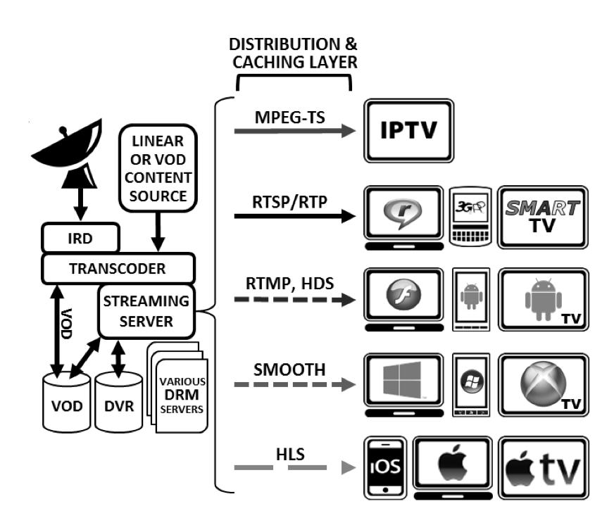

title: Live Streaming技术综述
comments: true
date: 2015-06-05 17:24:52
tags: Live Streaming
keywords: Live Streaming
description:
thumbnailImage:
coverImage:
photos:
---

#Live Streaming技术综述

##架构图

系统大致可以分解为如下几部分：

1. 音视频的编码。
2. 将编码后的（实时或VOD）数据给到Streaming Server，Server可以对数据进行DRM加密，转码等。
3. Streaming Server根据客户端的请求将数据转化为不同的格式，通过不同的协议分发到客户端。

可以参考这里的[视频](http://info.wowza.com/live-video-streaming-solutions-watch-how-to-video)

下面根据数据流的不同阶段来进行分析。

##技术分析

###音视频的编码和发布

####商业产品####

商业产品包括软件和硬件设备，下面主要列举了一些软件，硬件提供的功能和软件类似，并且有些还有辅助的软件。

***1. Wirecast***

Wirecast支持多种[输入源](http://www.telestream.net/wirecast/features.htm#capture)，包括WebCam, 视频采集卡，Web Stream, IP Camera等。除了音视频编码外，Wirecast还有许多相关的[辅助功能](http://www.telestream.net/application-content/wirecast/help/6-0/mac/tutorials.htm)，比如不同场景(shot)的切换，音频的组合选择，标题编辑，ScoreBoard，虚拟场景。Wirecast支持多种不同的Streaming平台，并且有一个YouTube的[定制版本](http://www.telestream.net/application-content/wirecast/YouTube/help/6-0/mac/index.html#Wirecast_Users_Guide/Tutorials/Tutorials.htm).

API支持: Wirecast API并没有提供比UI操作更丰富的[接口](http://forum.telestream.net/forum/messageview.aspx?catid=44&threadid=10540)，mac下可以通过[applescript控制](http://forum.telestream.net/forum/messageview.aspx?catid=45&threadid=12517)，Windows下提供了com接口（有第三方的[python API](https://github.com/DynamoBen/Wirecast/tree/master/API))，并非一个可以扩展的框架。

Encoder: H264, X264

价格: [Studio $495, Pro $995](http://www.telestream.net/wirecast/store.asp)

平台: MAC/WINDOWS

***2. UStream Producer***

功能和Wirecast类似。

价格: [Studio $279, Pro $549](http://www.telestream.net/wirecast/store.asp)

***3. Flash Media Live Encoder***

Flash Media Live Encoder支持的输入源包括webcam和视频采集卡，只支持一路视频。没有其他一些辅助功能。

API:  仅仅提供了[command line](http://help.adobe.com/en_US/FlashMediaLiveEncoder/3.0/Using/WS5b3ccc516d4fbf351e63e3d11c104babd5-7ffc.html)工具

Encoder: H264, VP6

平台: MAC/WINDOWS

价格: Freeware

***4. XSplit***

XSplit输入源包括Screen/Camera，支持多个场景(Scence)，标题编辑等辅助功能。

Encoder: H264

API: 无

平台: WINDOWS

价格: Personal $39.95/year,  Premium $59.95/year

***VID Blaster***

功能和Wirecast类似。

####开源产品####

***Open Broadcast Software***

OBS默认支持的[输入源](https://github.com/jp9000/OBS/wiki/Built-in-Sources)比较有限，但可以通过plugin方式进行扩展。OBS也支持多个场景([Scene](https://jp9000.github.io/OBS/general/scenes.html))，标题编辑，也支持多种不同的Streaming平台，如[TWITCH](https://twitchtips.com/obs-setup/), [YouTube](https://www.youtube.com/watch?v=dD0Z9VylyU8)。OBS原先只支持[Windows](https://github.com/jp9000/OBS)，新版本可以[跨平台](https://github.com/jp9000/obs-studio)，但还不完善。

API: 提供plugin接口

***WebcamStudio***

(WebcamStudio)[https://code.google.com/p/webcamstudio/]功能和OBS类似，但只运行在linux平台，且现在已经无人维护。

###Streaming服务器和cloud平台

***1. WOWZA***

产品线完整，包含Server和Cloud。支持所有主流的协议(HLS, HDS等)。输入源支持的也非常丰富，并且支持比较多的合作厂商的设备。输入源支持Push和Pull两种方式。

[Streaming Cloud](http://www.wowza.com/products/streaming-cloud/features)现在的API未公开，但看起来操作应该不会超出UI提供的功能。

[Streaming Server](http://www.wowza.com/products/streaming-engine)非常成熟, [API](http://www.wowza.com/resources/WowzaStreamingEngine_ServerSideAPI.pdf)非常丰富(复杂)。Server的部署和分发也提供相应的[支持](http://www.wowza.com/products/streaming-engine/deployment-options)。

另外WOWZA还提供了[GeoIP](http://www.wowza.com/products/streaming-engine/deployment-options)的数据库。

***2. Kaltura***

[Kaltura](http://knowledge.kaltura.com/live-streaming-using-kaltura-live-streaming-hds-hls-dash)的功能类似，也有服务器和cloud产品，从介绍上来看也非常完善。Kaltura是一套[开源](https://github.com/kaltura)的解决方案，也提供[商业服务](http://corp.kaltura.com/)。

***3. UStream***

[Ustream](http://www.ustream.tv/)仅仅提供Cloud服务，没有Server，但是却提供了Client的library，包括Android/iOS/Roku。

***4. Youtube***

Youtube也仅仅提供Cloud服务，没有Server。

***5. JWPlayer***

原先只是flash播放器，现在也在提供cloud服务。

##产品架构选型

###需求分析

能动态的根据用户相关的数据来实时生成广告版。现有的支持音视频编辑的软件可以mix多路视频，但这些都是在客户端发布视频之前做的，而用户相关的数据只有服务器端才有，所以需要在服务器端做mix。

##功能

**Dynamic Streaming**

**HTTP scalability**

**HTTP caching**

**Trickplay**

**Alternate video/audio track**

**Text streams**

**Rough cut editing**

**Ad insertion**

**Network DVR(Digital Video Recorder)**

**Stream recording**

**DRM(Digital Rights Management)**

##客户端

**JW Player**

**Flowplayer**

##协议

**UDP**

**TCP**

**RTSP/RTP**

**HTTP**

**Apple HLS**: HTTP Live Streaming

**Adobe HDS**: HTTP Dynamic Streaming

**Microsoft Smooth Streaming**

**MPEG-TS**: MPEG-2 Transport Streams，多用于IPTV

**MPEG-DASH Streaming**: Moving Picture Experts Group Dynamic Adaptive Streaming over HTTP

**MPD**: Media Presenation Descriptino

##名词解析

**ABR**: Adaptive bitrate streaming通过监测下行带宽的变化或用户的操作来自动适应带宽变化或屏幕大小变化。为了保证平滑的切换不同质量的视频，ABR对encoder是有一定要求的，需要编码的时候不同质量的关键帧能同步。

**SMIL**: Synchronized Multimedia Integration Language用来描述视频源可用的bitrate和size等配置，client可以根据这些配置来选择不同质量的视频。Mobile客户端和Desktop客户端一般会有不同的配置，不同的平台也有特定的要求（iOS bitrate不超过64 kbps)。

**DASH**: Dynamic Adaptive Streaming over HTTP

**HbbTV**: Hybrid Broadcast Broadband TV

**Container**: 容器就是把编码器生成的多媒体内容（视频，音频，字幕，章节信息等）混合封装在一起的标准。容器使得不同多媒体内容同步播放变得很简单，而容器的另一个作用就是为多媒体内容提供索引，也就是说如果没有容器存在的话一部影片你只能从一开始看到最后，不能拖动进度条（当然这种情况下有的播放器会话比较长的时间临时创建索引），而且如果你不自己去手动另外载入音频就没有声音。

##参考

1. [Adaptive Bitrate Streaming with Wowza Streaming Engine](http://info.wowza.com/abr-white-paper) 
2. [Media Cache White Paper](http://info.wowza.com/mediacache-white-paper)
3. [TV Anywhere White Paper](http://info.wowza.com/tv-anywhere-white-paper)
4. [SMB Market For Paid Video Streaming Services](http://www.dacast.com/white-papers/smb-market-for-paid-video-streaming-services/)
5. [streaming media server setup manual](http://www.slideshare.net/wiliwe/streaming-media-server-setup-manual)